# How to collaborate on Github

In a very basic way


LC Oct 2025


<figure>
  
  <figcaption>
    Henri Matisse – La Danse 1909, retrieved from 
    <a href="https://en.wikipedia.org/wiki/Dance_%28Matisse%29">Wikipedia</a>, Public Domain.
  </figcaption>
</figure>


## Authenticating on Github

Before you can interact with github by pushing changes to your repos, you need to establish a way to authenticate with github. For some time now, it is not anymore possible to use username and password. Instead, you should upload an ssh public key in your account. If you don't know what I am talking about, please [read this page](./ssh_keys.md), otherwise, just read on. 


## Github basic actions

Everything starts by creating a new repo on the github account. For instance [the one we are currently working with](https://github.com/leonardocerliani/collab_repo/tree/main). Upon creation, github will give you a list of command to run in the terminal so that you can create your own local version of the online repo, connect it to the remote version (on github) and start to write, commit and push online

```bash 
# For instance if you called the repo myNewRepo on the github website,
# mkdir myNewRepo and change dir into it (not necessary but highly recommended)
mkdir myNewRepo
cd myNewRepo

# This is what github prompts you to do next
#	Write a first header into a README.md file (will be displayed by default on the website)
echo "# myNewRepo" >> README.md

# initialize a repo locally
git init  

# add the README.md file you just created
git add README.md

# commit the change
git commit -m "first commit"

# switch to the main branch
git branch -M main

# add the remote location to sync the local repo with
git remote add origin git@github.com:leonardocerliani/myNewRepo.git

# push it to the remote repo, so that it will be displayed in github
git push -u origin main
```

It can seem like a handful, and indeed it is, but for now just execute those lines. It needs to be done only once.

In there, there are three git commands which represents what you will use  90% of the time:

- `git add .` : add all the files in the current dir(ectory) and subdir. These are all the files you want to track and stage for commit. If you have made a mistake (for instance you added some files that you do not want to track or appear on the github repo - see later `.gitignore`), you can do `git reset`.
-  `git commit -m "added a comment to the README.md file"` : now you create the actual snapshot that will be pushed to the website. Again in case of mistakes, you can do `git reset` but _only before having pushed to the remote repo_.
- `git push` : with this you upload new files or the changes you made to existing files to the github website.


## Adding a `.gitignore`

Often overlooked by beginners, this is IMHO probably the best feature of github. Let's say that you have your local repo in a folder in which there are also LLM API keys or data which are either very large or you just don't want to share. In this case you can add them to a `.gitignore` file - that you need to create - and they will stay only in your local repo. You can add both files and directories (name ending in `/`), and also use wildcards

```bash
# example of a .gitignore file

# ignore my_api_key.txt
my_api_key.txt

# ignore all the folders whose name starts with data
data*/

```


In the specific case that you want to check if you added some large files by mistake, you can run this

```bash
git diff --cached --name-only | xargs -I {} du -h {} | sort -hr
```

Remember that github rejects to push all files > 100MB


## Collaborators vs Contributors paradigms

A basic concept is that a repo has a `main` branch, where the main / production / live code is, and then several __branches__ which are not part of the main code. These are copies of the whole repo at a certain point in time, and are used by single users to work e.g. on new features of the code independently, even if the main code undergoes changes in the meanwhile.

There are two main ways in which a group can collaborate on a shared repo. 

- __Collaborators__: The owner of the repo - likely the person who created it - invites other users to collaborate. In this case everybody works on the same repo, likely in different branches.

- __Contributors__: The owner of the repo did not invite any collaborator, however anybody can __fork__ the repo - i.e. create a copy of the repo at one point in time - in her own github account and work on in independently. 

In both cases, when a user is done working on a new feature, she can ask to merge it with the main code by submitting a __pull request__. If this is accepted, it will be __pushed__ to the main code. However there is a big difference between the two approaches.

__Collaborators__ must make sure that they are working on their own branch, so that when they push modifications to github, they will not touch the main code, for which an authorized pull request is necessary. In case they make a mistake - typically forgetting to checkout on their own branch - they might pull it directly to the main code and potentially create conflicts or disasters.

Instead, when you are a __Contributor__, it means that you are working on your own personal copy of the repo, and you are not authorized to directly push to the main code of the main repository. You can only push to the main code of _your own copy_ of the repo. In this way, you are sure that if you make a mistake (e.g. deleting a folder in the main), there will always be a main code you can synchronize your repo with.

To summarize:

**Collaborators**

- have write access to the main repo
- can push, merge, manage issues and pull requests
- are added by the owner through invitation

**Contributors**

- do NOT have write access to the main repo, only to their own fork (copy) of the main repo
- contribute via pull requests
- changes must be reviewed and accepted (merged) by repo owner (and/or her collaborators if any)

Personally I find the latter modality more safe for beginners, exactly because of the aforementioned reasons. In addition, should be owner of the main repo make a mistake herself, there is still a good chance that one of the contributors has a safe copy of the whole repo that can be reinstated in the main repo.

Of course there are ways to "go back in time" and to prevent collaborators to directly push to main, but again for a beginner situation, I still think that the contributors paradigm is the safests and - also from the perspective of the main repo owner / maintainer - the easiest to manage.

**For this reason, I will propose below how the interaction on a repo can be carried out using the contributors paradigm, based on repo forks.**


## Fork and create a dev branch

Now we start with the actual part on collaboration. Let's say you are user `spam`, and you want to contribute to a repo. First thing to do is to fork it into your account.

This can be easily done by going to the github website of the github repo and press the Fork button. It makes sense to leave the same name of the original repo, but you can use whatever you want.


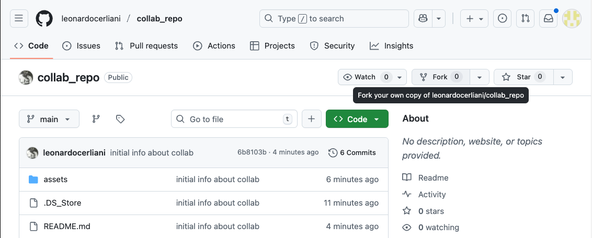 


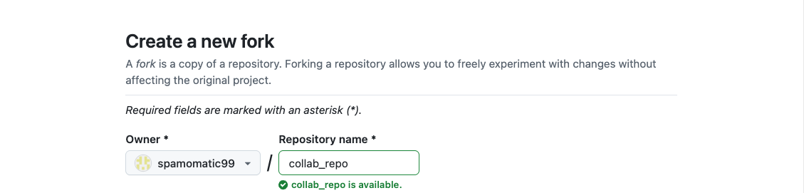


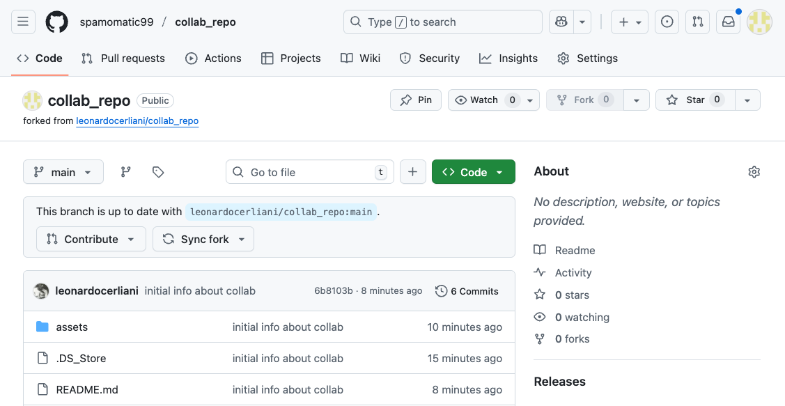


Now you have a full copy of the main repo on your account, that you can mess up like there is no tomorrow. If you do, you can still remove it and create another fork.

Note that github also informs you about the state of your fork with respect to the main repo. Since you just forked it, github informs you that "This brand is up to date with [the main repo]".

When - at some point - the main repo will be updated, next time you will visit your fork you might see something like:

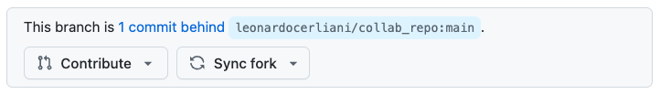

And _that_ is one of the reason why IMHO it's good, as soon as you fork the repo, to create also a __branch__.

Your fork of the main repo (hereafter: "your repo") now contains only the main branch. If you forked the main repo to just have a copy of it - e.g. in case the main repo gets deleted - that is fine, but if your intention is to modify it for your own use or for contributing a new feature, it is good to keep the original (hopefully working) forked version clean, and instead to start to do additions / modifications on a different branch.

For instance, in the diagram below, spam forks main at v2.0, and immediately creates a `dev` branch to start to make modifications.


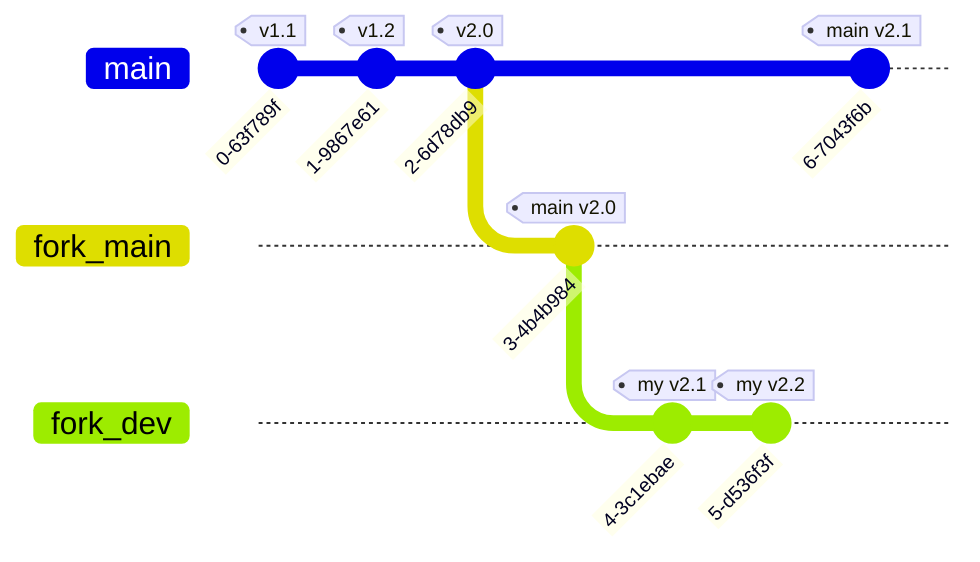

Let's see how this is done.

After having forked the main repo on the github website, spam clones the forked repo on the local computer

```bash
git clone git@github.com:spamomatic99/collab_repo.git
```

and then creates a `dev` branch and pushes it to github

```bash
git checkout -b dev
git push -u origin dev
```

Now when we look on the website, we will see that the spam's forked repo has _two_branches:

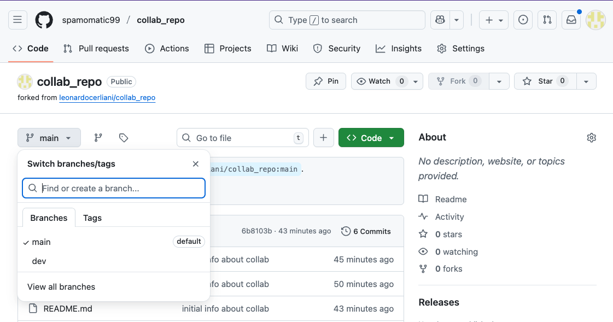

By default, when we enter the dir to carry on with our work, we will be in the last used branch. However, it's good to first check with git branch
```bash
git branch

spamomatic99@Mac collab_repo % git branch
* dev
  main
```


At this point, spam puts himself to work and produces a great new feature that he saves in the new file `spam_new_feature.md`. He then proceeds to add, commit and push.

Now we can see the advantages of creating a dev branch: if we mess something up, we can always create a new one and start anew. If we wouldn't have created the dev branch, we would have messed up the main branch, and now to start anew we would have to fork again from the main repo. However, in the meanwhile the version on the main repo could have advanced, so now we would need to start again anew also to look in the main repo code.


## Pull requests

The great moment has come. Spam has worked around the clock to finalize his great new feature, and is now ready to ask the owner of the main repo to merge it into the main code. This is the essence of a pull request.

To do this, spam goes on his github account and creates a pull request.

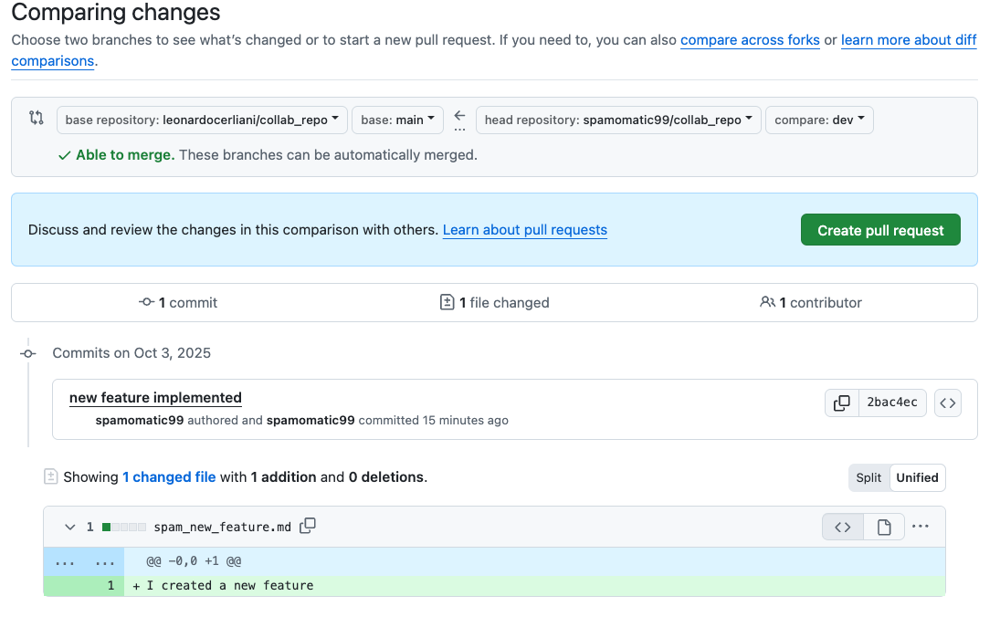

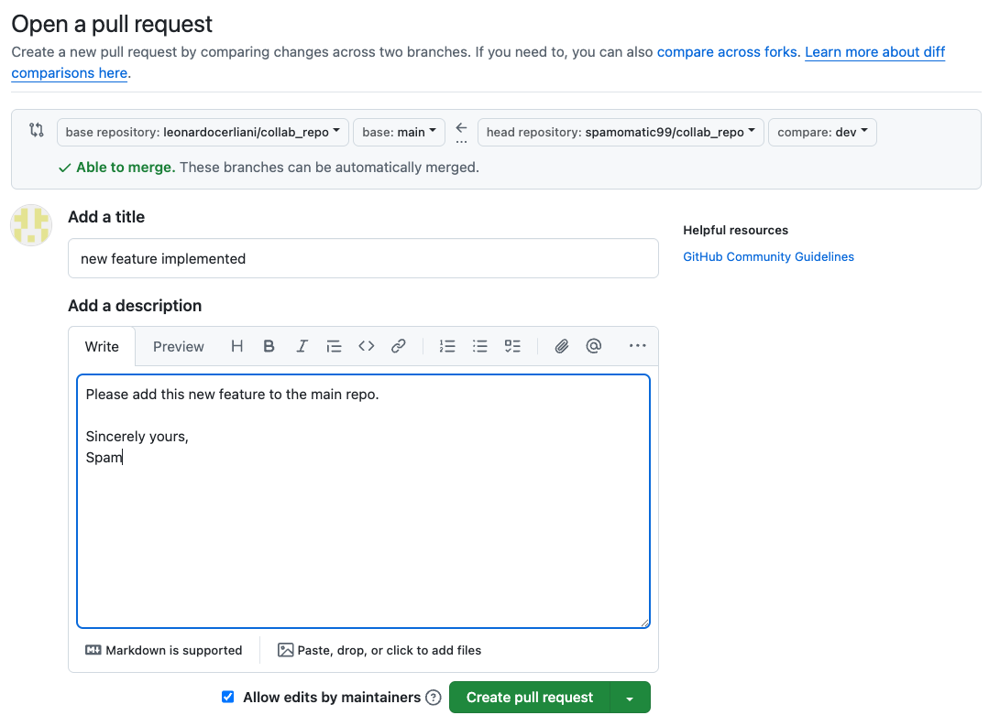


Now, next time that the main repo owner opens the github website, he will find the request by Spam.

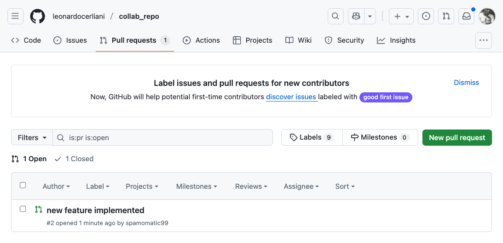


Fortunately, spam's new feature does not have any conflict, and therefore it can be easily merged into the main code.

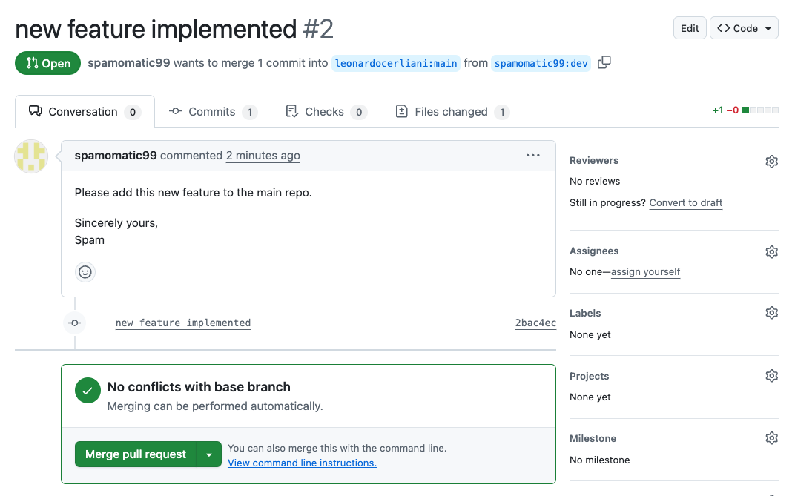


Now the new feature by spam is also present in the main repo

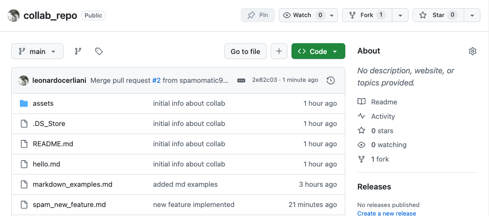


## Dealing with (small) conflicts

There can be of course conflicts, and they should be dealt with of a case-by-case basis. Here's a simple one.

The user Spam made a pull request (and I accepted it) while I was still writing this README.md file, therefore now that I am done and I try to push it to github, I encounter a problem:

```bash
$ git add .; git commit -m "finalized first version"; git push
[main b8b6fa6] finalized first version
 8 files changed, 115 insertions(+), 1 deletion(-)
 create mode 100644 assets/dev_branch_1.png
 create mode 100644 assets/fork_4.png
 create mode 100644 assets/pull_request_1.png
 create mode 100644 assets/pull_request_2.png
 create mode 100644 assets/pull_request_3.png
 create mode 100644 assets/pull_request_4.png
 create mode 100644 assets/pull_request_5.png
To github.com:leonardocerliani/collab_repo.git
 ! [rejected]        main -> main (fetch first)
error: failed to push some refs to 'github.com:leonardocerliani/collab_repo.git'
hint: Updates were rejected because the remote contains work that you do
hint: not have locally. This is usually caused by another repository pushing
hint: to the same ref. You may want to first integrate the remote changes
hint: (e.g., 'git pull ...') before pushing again.
hint: See the 'Note about fast-forwards' in 'git push --help' for details.
```

This happens because I am still working on an "old" version of the main, although the file on which I am working has not been touched by Spam.

*I actually made a mistake myself, because I was working on the main branch, while I should have also worked on a dev branch.*

Since the changes of Spam do not affect my edit, I can probably safely do a `git pull` to update my local repo with the remote repo, after which I can safely push my latest version of README.md to the remote.

However a safer version is to use `git fetch`.

What is the difference?

__`git fetch`__

- Downloads **all new commits, branches, and tags** from the remote repository.

- **Does not change your working files or branches**.

- Lets you inspect what’s new before merging it.

At this point you can open VS code and check for the changes 

Instead

__`git pull`__

- Downloads remote commits **and automatically integrates them** into your current branch.

- basically it does `git fetch && git merge origin/main`

Note that if there are conflicts, git pull will stop and prompt inspecting them, e.g. in VS code

In this case there are none, and now - after `git merge` or `git rebase`, I am again allowed to push to remote.


## Conclusion

This was a very simple example of a possible way to collaborate on the same code base using git and github. Of course problems will arise when there are conflicts between the the version which is requested to be merged in the main and the current version of the main itself, however that is probably too complex to deal with in a very basic tutorial.

Try to make experiments with your own colleagues, and decide the most appropriate policy for your group. 

You can also check out two nice videos which go more in detail:

- [Collaborations as Collaborators on the same main github repo](https://www.youtube.com/watch?v=ygqx50-JHEE&list=PLL2P7-i6TH_AWFMKH0gw8L0hc5RqBjKav&index=10)
- [The inevitable zero-to-pro video (but this is really nicely done)](https://www.youtube.com/watch?v=hrTQipWp6co&list=PLL2P7-i6TH_AWFMKH0gw8L0hc5RqBjKav&index=4)

