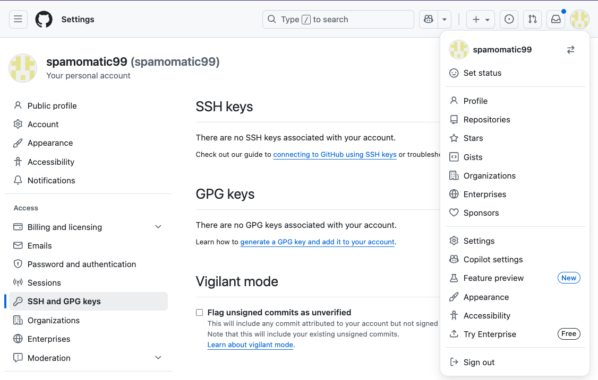
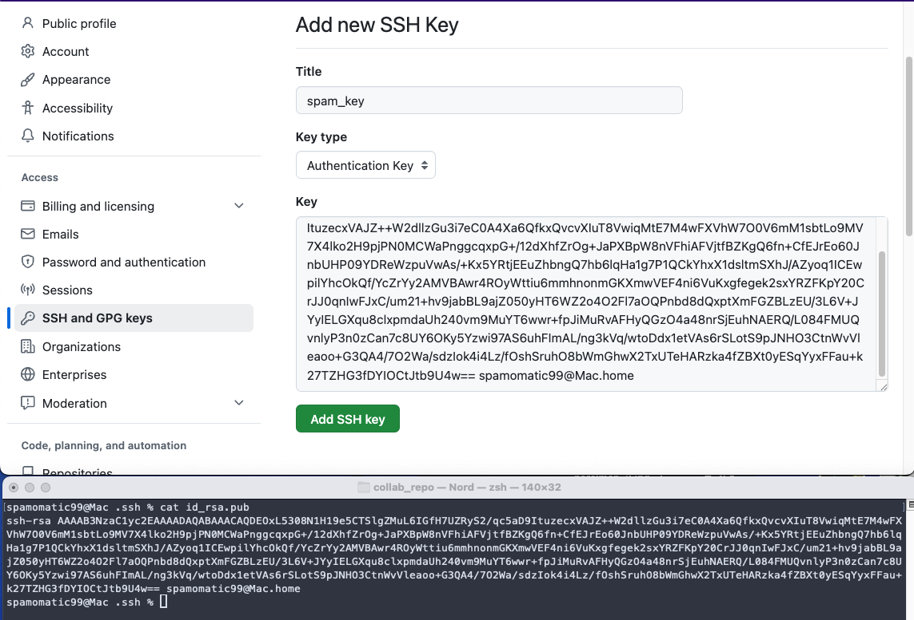

## Authenticating on Github

### Creating an ssh key pair

Before we start working on github we need to have a way to authenticate with github, in order to create repos(itories) and connect them with our local copy, and then push the changes to those repos.

To this aim, we must upload a public key to github. To do so, check if you already have a dir(ectory) `.ssh` and if there are two files in there, e.g. `id_rsa` and `id_rsa.pub`. If you have both the dir and the files, you can skip to the next part (uploading the public key to github), otherwise follow the commands below. They work for mac/linux and should be ok also for windoze.

```bash
# Open a shell and go to your home dir, e.g. C:\Users\thatsme or /Users/thatsme
# Create the .ssh if it's not there yet
mkdir .ssh
# Change into .ssh
cd .ssh
# Generate the ssh key pair and enter the default values until the keys are created
ssh-keygen -t rsa -b 4096
```

You should now have two files: `id_rsa` and `id_rsa.pub`. Forget, literally forget about the first one: it's your _private_ key and should _never_ be shared with _anyone_. 

From now on, just focus on the `id_rsa.pub`, which is your __public key__, and that's what you will upload to github to authenticate.


### Upload the public key on github

In your github account, click on your icon in the top-right and go to `Settings > SSH and GPG keys`. 

Right now there are still no keys.



at this point you can just copy / paste the newly created key.




